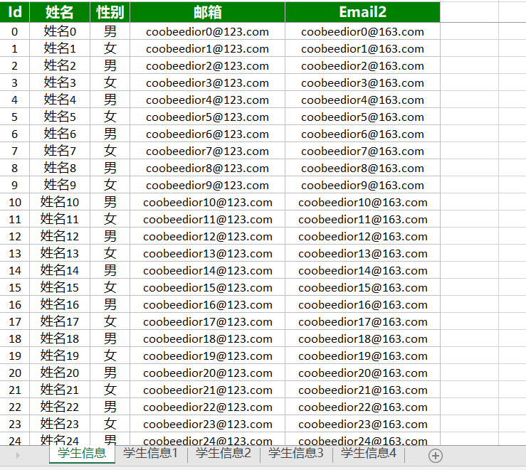
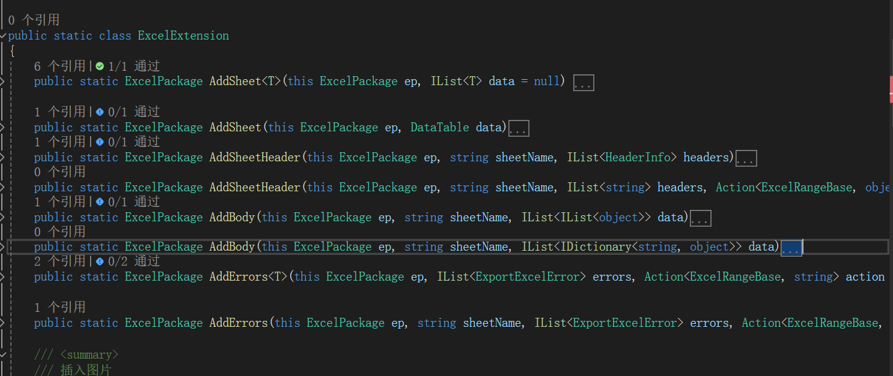
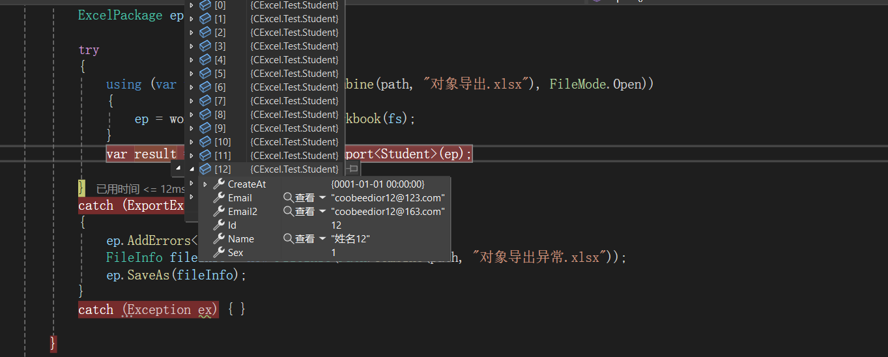
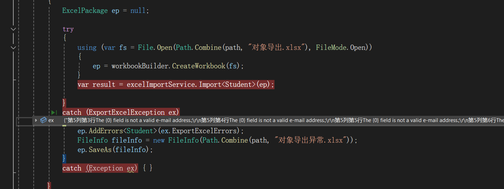
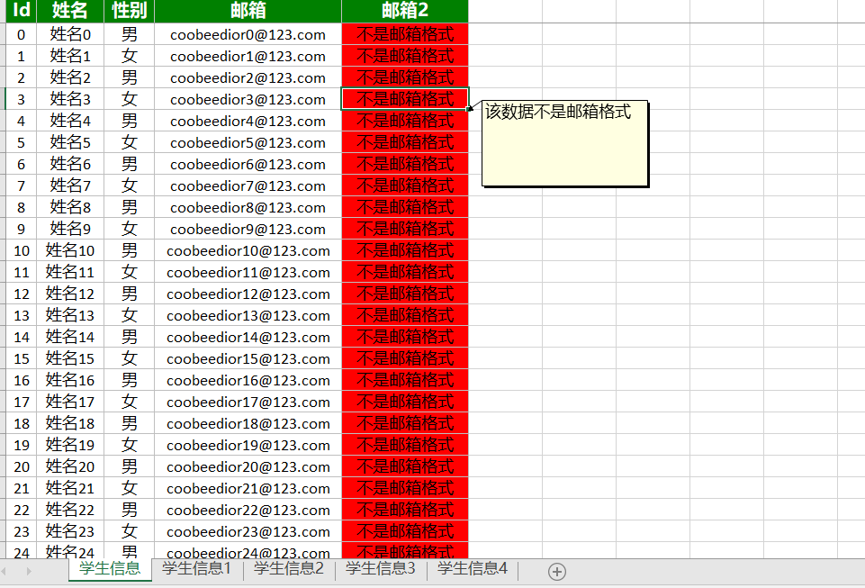

# 基于netCore的Office的服务

## EXCEL服务
其中 EEPLUS 、NOPI 、 Spire三个组件，可以自行决定使用任意组件
#### EEPLUS 使用方法 

1.导出Excel表格，支持实体、数组、dataTable三种方式导出
   ```csharp 
    //定义导入导出实体对象   
    [Excel("学生信息", true, typeof(StudentExcelTypeFormater))]
    public class Student
    {
        /// <summary>
        /// 主键
        /// </summary>
        //[ExcelColumn("Id", 1)]
        public int Id { get; set; }

        [ExcelColumn("姓名")]
        public string Name { get; set; }

        /// <summary>
        /// 性别 增加导入和导出处理  
        /// </summary>
        [ExcelColumn("性别", 3, typeof(SexExcelTypeFormater), typeof(SexExcelImportFormater))]
        public int Sex { get; set; }

        /// <summary>
        /// 邮箱
        /// </summary>
        [ExcelColumn("邮箱", 4)]
        [EmailAddress]
        public string Email { get; set; }

        /// <summary>
        /// 邮箱 
        /// </summary>
        //[ExcelColumn("邮箱2", 4)]
        [EmailAddress]
        public string Email2 { get; set; }

        /// <summary>
        /// 创建时间 过滤此字段
        /// </summary>
        [IngoreExcelColumn]
        public DateTime CreateAt { get; set; }
    }

    //性别导出处理
    public class SexExcelTypeFormater : DefaultExcelExportFormater
    {
        public override Action<ExcelRangeBase, object> SetBodyCell()
        {

            return (c, o) =>
            {
                base.SetBodyCell()(c, o);
                if (int.TryParse(o.ToString(), out int intValue))
                {
                    if (intValue == 1)
                    {
                        c.Value = "男";
                    }
                    else if (intValue == 2)
                    {
                        c.Value = "女";
                    }
                    else
                    {
                        c.Value = "未知";
                    }

                }
                else
                {
                    c.Value = "未知";
                }

            };
        }


    }
  
        //注入Excel服务
        services.AddCExcelService();
  
        //导出excel文件
        public void Export()
        {
            IList<Student> students = new List<Student>();
            for (int i = 0; i < 200; i++)
            {
                Student student = new Student()
                {
                    Id = i,
                    Name = $"姓名{i}",
                    Sex = i % 2 == 0 ? 1 : 2,
                    Email = $"coobeedior{i}@123.com",
                    CreateAt = DateTime.Now.AddDays(-1).AddMinutes(i),
                    Email2 = $"不是邮箱格式"
                };
                students.Add(student);
            }
            try
            {

                var excelPackage = exportService.Export<Student>(students).AddSheet<Student>().AddSheet<Student>().AddSheet<Student>().AddSheet<Student>();

                FileInfo fileInfo = new FileInfo(Path.Combine(path, "对象导出.xlsx"));
                excelPackage.SaveAs(fileInfo);
            }
            catch (Exception ex)
            {

            }

        }  
```
导出数据如下图所示 

 
其他导出数据格式方法

 

2.导入数据

```csharp
   //导入excel数据
   public void Import()
   {
       ExcelPackage ep = null;
       try
       {
           using (var fs = File.Open(Path.Combine(path, "对象导出.xlsx"), FileMode.Open))
           {
               ep = workbookBuilder.CreateWorkbook(fs);
           }
           var result = excelImportService.Import<Student>(ep);

       }
       catch (ExportExcelException ex)//每个表格的数据会根据实体定义的DataTypeAttribute进行校验，校验不合格会把所有异常数据统计出来
       {
           ep.AddErrors<Student>(ex.ExportExcelErrors);
           FileInfo fileInfo = new FileInfo(Path.Combine(path, "对象导出异常.xlsx"));
           ep.SaveAs(fileInfo);
       }
       catch (Exception ex) { }

   }

    //性别导入数据处理
    public class SexExcelImportFormater : IExcelImportFormater
    {
        public object Transformation(object origin)
        {
            if (origin == null)
            {
                return 0;
            }
            else if (origin?.ToString() == "男")
            {
                return 1;
            }
            else if (origin?.ToString() == "女")
            {
                return 2;
            }
            else
            {
                return 0;
            }
        }
    }
```
如下图所示: 


3.导入出现数据错误

excel表格格式错误的数据默认处理会标红，并且标记错误信息。

---
欢迎大家使用，谢谢大家的赞助，会奉献更好的功能给大家
